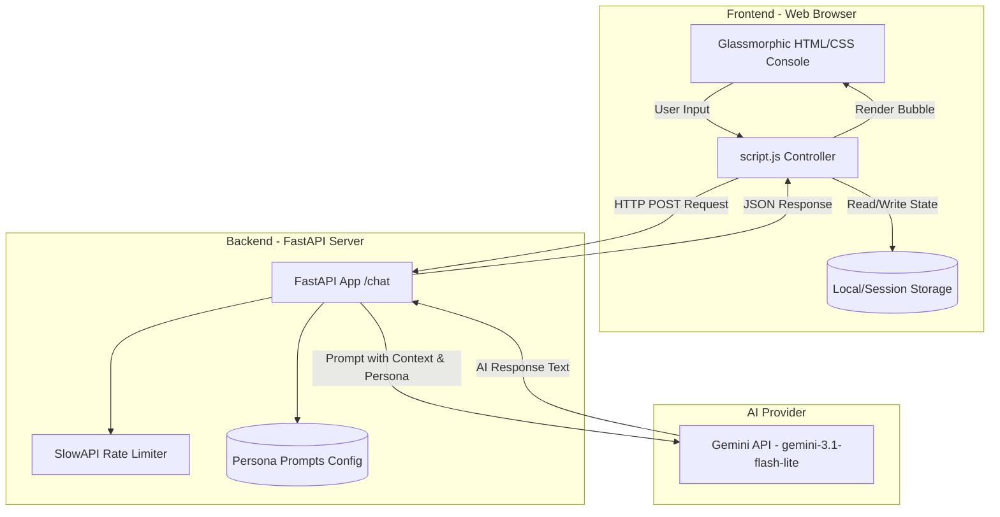

# NeonChat // Futuristic AI Console

NeonChat is a premium, web-based chat console that pairs a futuristic glassmorphic UI with a fast, rate-limited FastAPI backend. Leveraging the Gemini API via the `google-genai` SDK, NeonChat hosts 11 custom AI personas with dynamic context-aware personalities.

---

## 🚀 Tech Stack

### Frontend
*   **HTML5:** Semantic architecture integrated with dynamic icons.
*   **Vanilla CSS3:** Advanced variables-driven styling, responsive drawer layout, light/dark themes, floating background glow animations, and glassmorphism.
*   **Vanilla JavaScript:** Lightweight event-driven logic managing input characters, async fetch calls, message streams, loading states, and state persistence.
*   **Lucide Icons:** Modern vector iconography loaded dynamically.
*   **Storage API:** Browser `localStorage` maintains theme options, while `sessionStorage` tracks short-term chat histories.

### Backend
*   **FastAPI:** Asynchronous Python web application framework.
*   **Google GenAI SDK:** High-performance integration with Gemini APIs.
*   **SlowAPI:** Rate-limiting middleware protecting resources against abuse.
*   **Pydantic:** Type-safe data schema models for incoming payloads.
*   **Python-dotenv:** Environment settings configurations.

---

## 🛠️ Architecture

NeonChat relies on a decoupled, client-server design where the frontend communicates with the backend via stateless JSON payloads, storing short-term conversation logs in browser session storage to construct context windows on demand.



### Prompt Orchestration
When a user sends a message, the client packages the user's input, the active persona token, and the recent exchange history (up to the last 4 messages for token efficiency). The backend formats these components together:
1.  **System Persona definition**: Configures tone, character rules, and safety boundaries.
2.  **Conversation history**: Injects past QA context to provide conversational memory.
3.  **User query**: Appends the latest prompt.

The final formatted prompt is sent to `gemini-3.1-flash-lite` to obtain the stylized response.

---

## ✨ Features

*   **11 Cybernetic Personas:** Select companion styles ranging from casual chats to intense coaching or study guides:
    *   💬 **Friendly AI**: Warm, casual, and supportive chat assistant.
    *   💅 **Toxic Girlfriend**: Jealous, dramatic, clingy, playful roaster.
    *   🦚 **Indian Mom**: Caring scolder in Hinglish, obsessed with health & screen time.
    *   🪓 **Savage Roast**: Brutally sarcastic stand-up comedian roasting queries.
    *   💀 **Gen Z Brainrot**: Meme-addicted slang speaker with cooked vibes.
    *   👑 **Sigma Guru**: Delusional grindset coach turning normal life legendary.
    *   🧙‍♂️ **Medieval Wizard**: Wise fantasy wizard sharing scrolls of ancient sorcery.
    *   🍺 **High Uncle**: Confusing philosophical rants and absurd random connections.
    *   💻 **Coding Mentor**: Logical, helpful programmer teaching code step-by-step.
    *   📚 **Strict Teacher**: Disciplined academic setting mini tasks and study feedback.
    *   🎯 **Productivity Commander**: Tactical mission leader pushing action and discipline.
*   **Dual Color Themes:** Fluid switching between neon Cyberpunk Dark and Clean Tech Light modes.
*   **Session Persistence:** Automatically retains your active persona and chat log upon browser refresh.
*   **Rate Limiting Protection:** Backed by SlowAPI limiting to `5 requests/minute` per IP address, showing helpful notifications in the UI when limits are hit.
*   **Optimized UX Controls:** Real-time character counter (maximum 250 characters), keybinding submit on Enter, auto-scroll chat window, and responsive sidebar drawers for mobile screens.

---

## 🏃 Getting Started

### Prerequisites
*   Python 3.10 or higher
*   Gemini API Key (Get one from [Google AI Studio](https://aistudio.google.com/))

### 1. Backend Configuration
Navigate to the `backend` folder and configure the application:

```bash
cd backend

# Create a virtual environment
python -m venv venv

# Activate the virtual environment
# On Windows (PowerShell):
.\venv\Scripts\Activate.ps1
# On macOS/Linux:
source venv/bin/activate

# Install required dependencies
pip install fastapi uvicorn google-genai python-dotenv slowapi
```

Create a `.env` file inside the `backend` directory:
```env
GEMINI_API_KEY=your_gemini_api_key_here
```

Start the local API development server:
```bash
uvicorn main:app --reload
```
The backend API will run on `http://127.0.0.1:8000`.

### 2. Frontend Launch
Since the frontend uses pure client-side standard technologies, you can open it directly:
*   Simply open `frontend/index.html` in your web browser.
*   Alternatively, serve it locally using any basic HTTP server:
    ```bash
    cd frontend
    # For Python:
    python -m http.server 8080
    # For Node:
    npx serve
    ```
    Then visit `http://localhost:8080` in your browser.
